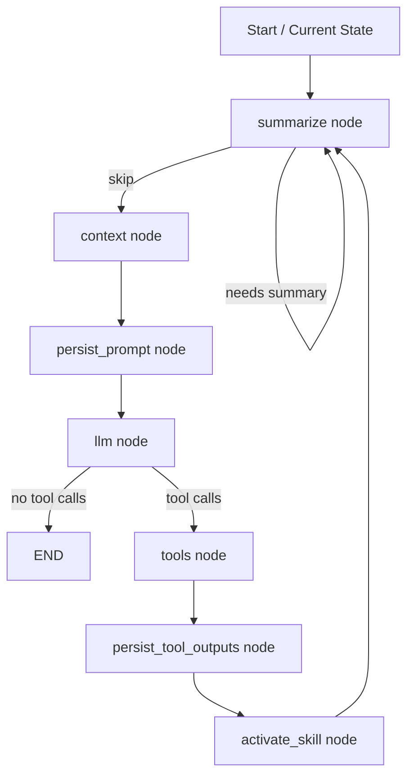

# Emergent Planner: Agentic Architecture Documentation

## 1. Purpose and Scope

This document explains how the Emergent Planner agent works end-to-end, based on the implementation in `src/emergent_planner/` and `main.py`.

It covers:
- runtime topology (LangGraph state machine)
- state model and data contracts
- prompt/context assembly and budgeting
- tool execution and skill activation
- memory summarization
- human-in-the-loop (HITL) interruption/resume
- observability and debug surfaces
- extension points and known design constraints

## 2. High-Level Architecture

The system is a **graph-driven, tool-augmented conversational agent** built on:
- LangGraph for orchestration and checkpointed execution
- LangChain messages/tools for model and tool interoperability
- a policy-driven context manager for prompt composition
- explicit runtime/memory state for continuity and control

Primary composition path:
1. Build a prompt from prompt cards + memory + skills + curated history.
2. Invoke the LLM.
3. If the LLM emits tool calls, execute tools and append tool outputs.
4. Persist large tool outputs to artifacts and optionally activate a skill from tool output.
5. Periodically summarize history into memory to control context growth.
6. Repeat until no tool call is emitted.

Core builder: `build_app(...)` in `src/emergent_planner/graph.py`.

## 3. Runtime Topology (State Graph)

### 3.1 Nodes

Graph nodes are assembled in `build_app(...)`:
- `summarize` -> `summarize_node(...)`
- `context` -> `context_node(...)`
- `persist_prompt` -> `persist_prompt_artifact_node(...)`
- `llm` -> `llm_node(...)`
- `tools` -> `tools_node(...)`
- `persist_tool_outputs` -> `persist_tool_outputs_node(...)`
- `activate_skill` -> `activate_skill_from_tool_result_node(...)`

All nodes are wrapped by `instrument_node(...)` for telemetry.

### 3.2 Control Flow

Entry point: `summarize`

Edges/routers:
- `summarize` conditionally loops to itself when `should_summarize(...) == "summarize"`, else continues.
- `summarize -> context -> persist_prompt -> llm`
- `llm` conditionally routes:
  - `tools` if last AI message contains tool calls (`has_tool_calls(...) == "tools"`)
  - `END` otherwise
- `tools -> persist_tool_outputs -> activate_skill -> summarize`

This produces a cyclic "think -> act -> integrate -> think" loop until a final non-tool AI response is produced.

## 4. State Model and Contracts

`AgentState` (TypedDict, `src/emergent_planner/models.py`) defines shared state keys:
- `history: List[AnyMessage]` — canonical conversation log
- `messages: List[AnyMessage]` — curated prompt payload for next LLM call
- `memory: Dict[str, Any]` — summary/plan/episodic memory
- `runtime: Dict[str, Any]` — transient control flags and metadata
- `skills: List[SkillMeta]` — discovered skill registry
- `file_system` — merged via `file_reducer`
- `telemetry: List[Dict[str, Any]]` — per-node observability entries

Important runtime fields used in behavior:
- `run_id`, `trace_id`, `turn_index`
- `after_tool`
- error markers: `last_error`, `last_failed_node`, traceback
- active skill markers: `active_skill_name`, `active_skill_body`, `active_skill_meta`
- prompt artifacts: `prompt_artifacts`

## 5. Prompt/Context Construction Pipeline

Context composition is handled by `ContextManager.compose(...)` in `context_manager.py`.

### 5.1 Signals

`detect_signals(...)` derives `ContextSignals`:
- first turn?
- after tool?
- error present?
- planning needed? (`force_planning` or long user input > 280 chars)
- user asked capabilities?

### 5.2 Prompt Layers

`compose(...)` assembles prompt messages in this order:
1. **Prompt cards** selected by signal tags (`core`, `after_tool`, `error`, `planning`) from `PromptLibrary`.
2. **Active skill body** injected if set in runtime.
3. **Skills registry listing** (Top-K skill names/descriptions) when gating condition passes.
4. **Memory blocks** (summary, plan) as system messages.
5. **Curated history** (with tool-message compaction).

### 5.3 Budgeting

`_fit_to_budget(...)` enforces `BudgetPolicy`:
- budget target = `max_prompt_tokens - reserved_for_generation`
- system messages are retained first and truncated if required
- non-system messages are included from newest backward until budget is met

Token accounting is heuristic (`~1 token per 4 chars`) via `msg_tokens(...)`.

## 6. Prompts and Behavioral Policy

Default prompt cards are in `prompts.py` and include:
- system role and identity
- strict planning instructions
- tool-followup guidance
- error-recovery guidance

Notable design choice:
- planning policy is encoded in prompt text (create/update `plan.md`, seek approval via `verify_with_user`), not as a hard-coded runtime controller.

Configuration policy dataclasses (`policies.py`):
- `BudgetPolicy`
- `ToolLogPolicy`
- `SummaryPolicy`
- `AppPolicy` (placeholder umbrella)

## 7. Tooling Architecture

Tools are defined in `tools.py` and exposed as `DEFAULT_TOOLS`:
- `read_file`
- `read_file_range`
- `write_file`
- `python_repl` (restricted builtins/imports)
- `load_skill`
- `verify_with_user` (HITL interrupt)

### 7.1 Tool Execution in Graph

`tools_node(...)` delegates execution to LangGraph `ToolNode` using current `history` as `messages`.

After execution:
- tool result messages are appended to `history`
- `runtime.after_tool` is set true

### 7.2 Large Tool Output Handling

`persist_tool_outputs_node(...)` scans `ToolMessage`s:
- if content length exceeds `ToolLogPolicy.max_inline_chars`, full text is persisted to
  `artifacts/tool_logs/<run_id>/<tool_call_id>.txt`
- history tool message is replaced with a truncated snippet + pointer path

This keeps prompt/history tractable while preserving full forensic output on disk.

## 8. Skill System

### 8.1 Discovery and Registry

`discover_skills(...)` scans `.skills/<dir>/SKILL.md` and parses YAML frontmatter:
- required: `name`, `description`
- body is not loaded during discovery (lazy)

### 8.2 Retrieval and Activation

- LLM can call `load_skill(skill_name)`.
- Tool returns JSON including `body`.
- `activate_skill_from_tool_result_node(...)` parses recent tool output; when payload includes `name` + `body`, it sets active skill in runtime.
- `ContextManager` injects active skill body into subsequent prompt as system message.

This creates a two-step skill lifecycle:
1. lightweight registry exposure (for discovery/routing)
2. on-demand full instruction activation

### 8.3 Skill Ranking in Prompt

`render_skills_topk(...)` uses a simple lexical scorer over user text vs. skill name/description and outputs a bounded "available skills" list.

## 9. Memory and Summarization

`summarize_node(...)` in `nodes.py` controls memory compression:
- trigger when history length exceeds threshold (`SummaryPolicy.summarize_when_history_len_exceeds`)
- summarize older portion, keep latest N messages
- merge into `memory.summary` with a structured template:
  - Goals
  - Decisions
  - Tool outcomes
  - Open tasks
  - Constraints

Output effects:
- `memory.summary` updated
- `history` truncated to most recent messages
- `runtime.summarized = True`

## 10. Human-in-the-Loop (HITL)

### 10.1 Interrupt Primitive

`verify_with_user(...)` tool calls `langgraph.types.interrupt(...)`, which pauses execution and emits interrupt payload.

### 10.2 Resume Orchestration

`record_run(...)` in `debug_ui.py` streams graph values and handles interrupts:
- captures step snapshots (`Step`)
- if interrupt encountered and auto-resume enabled:
  - call `on_interrupt(payload, full_state)`
  - resume graph with `Command(resume=answer)`

`main.py` provides a CLI `on_interrupt(...)` for confirm/pick-one/free-text responses.

Checkpoint requirement:
- resume needs compiled app with checkpointer (`MemorySaver` used in `build_app`).
- stable `thread_id` in config ensures continuation continuity.

## 11. Observability and Debugging

### 11.1 Telemetry Wrapper

`instrument_node(...)` adds per-node telemetry entries including:
- correlation IDs: `trace_id`, `run_id`, `step_id`, `turn_index`
- timing: start/end/elapsed
- status and error taxonomy
- updated state keys
- message count and approximate token stats
- optional tool-call extraction and prompt fingerprint
- optional coarse state size estimates

Error path behavior:
- runtime error fields updated
- configurable `swallow_exceptions` (default false)

### 11.2 Prompt Artifacts

`persist_prompt_artifact_node(...)` stores serialized prompt text in `runtime.prompt_artifacts` per turn, enabling debug UIs even when raw prompt messages are unavailable.

### 11.3 Debug Surfaces

`debug_ui.py` provides:
- `record_run(...)` for deterministic step recording
- renderers for history/prompt/diffs/runtime/memory/telemetry/tool inspector
- optional notebook `SotaGraphUI` widget for interactive playback

## 12. Entry Point Composition (`main.py`)

Startup sequence:
1. Load env.
2. Build Google Gemini model and bind tools.
3. Discover skills from `.skills`.
4. Build graph app with prompt library and policies.
5. Seed initial state (`history`, `memory`, `runtime`, `skills`).
6. Execute with `record_run(...)` and interrupt handler.
7. Print final AI message from final state history.

This is a reference runner, not a framework lock-in; graph and policies are modular.

## 13. Extension Points

Clean extension seams:
- add/replace tools in `DEFAULT_TOOLS` or pass custom tool list to `build_app(...)`
- customize prompt cards via `PromptLibrary`
- tune `BudgetPolicy`, `SummaryPolicy`, `ToolLogPolicy`
- add router conditions or new nodes in `graph.py`
- swap LLM provider so long as it supports tool calls and `.invoke(...)`
- enhance skill scoring/discovery without touching orchestration

## 14. Operational Characteristics and Constraints

1. Prompt-policy dependence:
- planning/HITL discipline mostly relies on prompt compliance rather than strict controller enforcement.

2. Token estimation is heuristic:
- budget logic uses character-based token approximation; actual provider tokenization may differ.

3. Tool-output persistence is file-based:
- artifacts are local filesystem paths; portability depends on runtime environment.

4. Skill activation contract is JSON-convention based:
- `activate_skill_from_tool_result_node(...)` expects parseable JSON with `name` and `body`.

5. Summarization trigger is count-based:
- history-length threshold, not true token-count pressure, triggers summarization.

## 15. Sequence Diagram (Conceptual)

## 16. File Map

- `src/emergent_planner/graph.py`: graph assembly and routing
- `src/emergent_planner/nodes.py`: node implementations + instrumentation
- `src/emergent_planner/context_manager.py`: prompt composition and budgeting
- `src/emergent_planner/prompts.py`: default prompt cards
- `src/emergent_planner/policies.py`: policy dataclasses
- `src/emergent_planner/tools.py`: tool implementations and default tool list
- `src/emergent_planner/skills.py`: skill parsing/discovery/ranking
- `src/emergent_planner/models.py`: state and model contracts
- `src/emergent_planner/utils.py`: normalization, token heuristics, diff/observability helpers
- `src/emergent_planner/debug_ui.py`: run recorder + notebook debug UI
- `main.py`: executable reference wiring

## 17. Recommended Next Improvements

1. Enforce planning/HITL in deterministic controller logic (not only prompt text).
2. Replace heuristic token counting with provider tokenizer integration.
3. Add explicit retries/backoff policies for transient tool/LLM failures.
4. Validate skill payload schema before activation to harden against malformed tool output.
5. Add persistence abstraction for artifacts if deploying across ephemeral workers.

