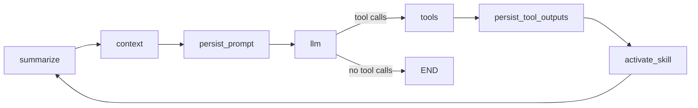

# Emergent Planner: Agentic Architecture (1–2 Pager)

## What This System Is

Emergent Planner is a **LangGraph-based, tool-using agent runtime**. It combines:
- a graph orchestrator (control flow)
- policy-based prompt/context assembly
- tool execution + skill loading
- optional human-in-the-loop approval gates
- memory summarization + telemetry

It is designed for iterative "think -> act -> integrate" execution until completion.

## Core Runtime Loop

Graph builder: `build_app(...)` in `src/emergent_planner/graph.py`

Execution behavior:
1. Summarize old history when threshold exceeded.
2. Compose next prompt from policy-selected context.
3. Invoke LLM.
4. If LLM emitted tool calls, execute tools.
5. Persist oversized tool outputs to artifacts.
6. Activate skill context if a skill was loaded.
7. Loop.

## State Model (Single Source of Truth)

`AgentState` (`src/emergent_planner/models.py`) drives all nodes:
- `history`: canonical conversation + tool transcript
- `messages`: curated prompt sent to LLM
- `memory`: long-horizon summary/plan notes
- `runtime`: turn flags, errors, active skill, run IDs
- `skills`: discovered skill registry metadata
- `telemetry`: per-node observability entries

Key runtime flags:
- `turn_index`, `after_tool`
- `last_error`, `last_failed_node`
- `active_skill_name`, `active_skill_body`

## Prompting and Context Assembly

ContextManager (`src/emergent_planner/context_manager.py`) composes prompt in layers:
1. Prompt cards (core + conditional cards)
2. Active skill body (if loaded)
3. Skills registry preview (Top-K skill descriptions)
4. Memory blocks (summary/plan)
5. Curated history (tool output compacted)

Budget enforcement (`BudgetPolicy`):
- reserve generation headroom
- keep/truncate system messages first
- backfill latest non-system messages within budget

Default behavior prompts are in `src/emergent_planner/prompts.py` and include:
- planning-first workflow
- verify-with-user checkpoints
- post-tool integration guidance
- error recovery guidance

## Tooling and Skills

Default tools (`src/emergent_planner/tools.py`):
- file read/write
- restricted `python_repl`
- `load_skill`
- `verify_with_user` (HITL interrupt)

Skill lifecycle:
1. Discover skill metadata from `.skills/*/SKILL.md`.
2. LLM calls `load_skill(name)` when needed.
3. Tool returns `{name, description, body, meta}` JSON.
4. Activation node stores skill body in runtime.
5. ContextManager injects active skill as system guidance next turn.

This keeps baseline prompts small while enabling on-demand specialization.

## Memory and History Compression

Summarization node (`summarize_node`):
- triggers when history length exceeds policy threshold
- compresses older messages into `memory.summary`
- keeps latest N messages verbatim

Outcome: bounded prompt growth with preserved task continuity.

## Human-in-the-Loop (HITL)

`verify_with_user(...)` uses LangGraph interrupt/resume semantics:
- tool call pauses run with payload (question, type, choices, context)
- runtime resumes with `Command(resume=answer)`

`record_run(...)` in `debug_ui.py` handles this loop and captures step snapshots.

## Observability and Debug Surfaces

Every node is wrapped by `instrument_node(...)`, which logs:
- node timings and status
- updated keys
- approximate token/count metrics
- prompt fingerprint
- tool-call metadata
- structured error taxonomy

Additional visibility:
- prompt artifacts captured per turn
- step recorder and notebook UI for state/prompt/telemetry diffs

## Extending the System

Most common extension seams:
- Add/replace tools via `DEFAULT_TOOLS` or `build_app(..., tools=...)`
- Add prompt cards or custom prompt library
- Tune policies (`BudgetPolicy`, `SummaryPolicy`, `ToolLogPolicy`)
- Add graph nodes/routers for stricter control logic
- Improve skill ranking/discovery heuristics

## YAML Agent Profiles

Runtime now supports profile-based specialization through config:
- profile-selectable prompts (`merge` or `replace`)
- profile-selectable tools (allow/deny over built-ins + safe custom imports)
- profile-scoped skills roots and optional skill allowlist

See `docs/AGENT_PROFILES.md` for schema and examples.

## Current Design Tradeoffs

1. Planning discipline is mostly prompt-enforced, not hard-enforced.
2. Token budgeting uses character heuristics, not provider tokenizer.
3. Skill activation expects valid JSON payload shape from tool output.
4. Summarization trigger is history-count based, not direct token pressure.

## Practical File Map

- `src/emergent_planner/graph.py`: graph topology
- `src/emergent_planner/nodes.py`: node logic + telemetry wrapper
- `src/emergent_planner/context_manager.py`: prompt assembly and budget fit
- `src/emergent_planner/tools.py`: tools + HITL interrupt
- `src/emergent_planner/skills.py`: skill parsing/discovery/ranking
- `src/emergent_planner/prompts.py`: prompt cards
- `src/emergent_planner/policies.py`: tuning knobs
- `src/emergent_planner/debug_ui.py`: run recorder and UI
- `main.py`: reference runtime wiring

## Quick Mental Model

Emergent Planner is a **stateful execution graph** where each turn is:
- **prepare context** -> **reason** -> **act with tools (optional)** -> **integrate** -> **repeat**,
with **memory compression**, **human approval checkpoints**, and **deep telemetry** built in.
